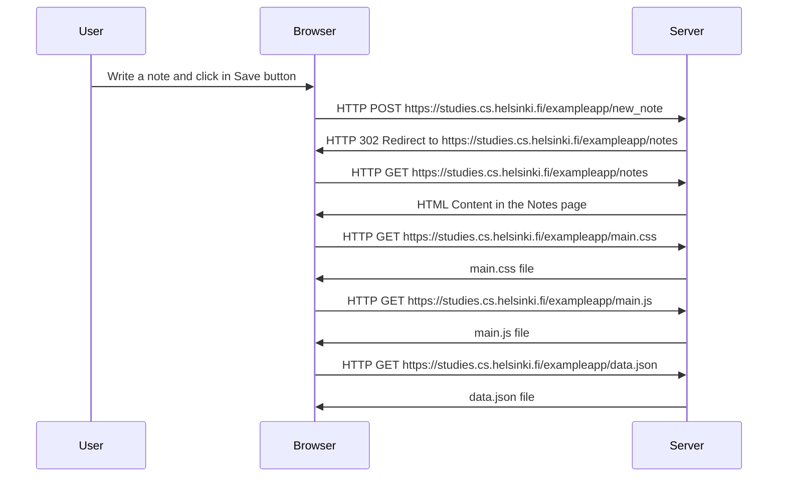

```mermaid
sequenceDiagram
    participant User
    participant Browser
    participant Server

    User->>Browser: Write a note and click in Save button
    Browser->>Server: HTTP POST https://studies.cs.helsinki.fi/exampleapp/new_note
    Server->>Browser: HTTP 302 Redirect to https://studies.cs.helsinki.fi/exampleapp/notes
    Browser->>Server: HTTP GET https://studies.cs.helsinki.fi/exampleapp/notes
    Server->>Browser: HTML Content in the Notes page
    Browser->>Server: HTTP GET https://studies.cs.helsinki.fi/exampleapp/main.css
    Server->>Browser: main.css file
    Browser->>Server: HTTP GET https://studies.cs.helsinki.fi/exampleapp/main.js
    Server->>Browser: main.js file
    Browser->>Server: HTTP GET https://studies.cs.helsinki.fi/exampleapp/data.json
    Server->>Browser: data.json file

```